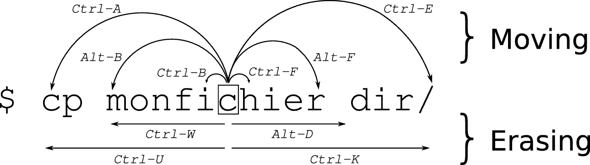

# PeterBay_CircuitPython_Prompt

A set of libraries for a better CLI applications in CircuitPython

**Warning: This is a work in progress but most of the features are already implemented. Another features and functions will be added in the future.**

### Installation

Copy the `peterbay_prompt` folder to the `lib` folder on your CircuitPython device.

### Usage

For usage examples see the [examples](examples) folder.

### Features

- **non blocking** input from serial interface - your application can do something else while waiting for input
- you can **move cursor** in the line and **edit** it
- keyboard **shortcuts** like in a BASH

### Terminal / Prompt features

- **autocomplete** for commands in terminal
- **history** of commands in terminal
- **aliases** for commands in terminal

### Available libraries

| file                                               | description                          |
| -------------------------------------------------- | ------------------------------------ |
| [alias.py](peterbay_prompt/alias.py)               | managing aliases for terminal        |
| [autocomplete.py](peterbay_prompt/autocomplete.py) | managing autocomplete for terminal   |
| [colors.py](peterbay_prompt/colors.py)             | escape sequences for colors          |
| [cursor.py](peterbay_prompt/cursor.py)             | escape sequences for cursor          |
| [history.py](peterbay_prompt/history.py)           | managing history for terminal        |
| [input.py](peterbay_prompt/input.py)               | managing input from serial interface |
| [menu.py](peterbay_prompt/menu.py)                 | multi-level CLI menu                 |
| [prompt.py](peterbay_prompt/prompt.py)             | CLI prompt like in a BASH            |
| [select.py](peterbay_prompt/select.py)             | select from list of items            |
| [serial_io.py](peterbay_prompt/serial_io.py)       | managing serial interface            |
| [terminal.py](peterbay_prompt/terminal.py)         | CLI terminal like in a BASH          |
| [tokenizer.py](peterbay_prompt/tokenizer.py)       | CLI tokenizer like in a BASH         |
| [validator.py](peterbay_prompt/validator.py)       | validator for input                  |
| [value.py](peterbay_prompt/value.py)               | managing values for terminal         |
| [wizard.py](peterbay_prompt/wizard.py)             | questionary like                     |

#### Keyboard shortcuts available in the prompt and terminal

| shortcut    | description                                     |
| ----------- | ----------------------------------------------- |
| `Backspace` | delete character before cursor                  |
| `Delete`    | delete character after cursor                   |
| `Down`      | next command from history (if available)        |
| `End`       | move cursor to the end of the line              |
| `Enter`     | execute command                                 |
| `Home`      | move cursor to the beginning of the line        |
| `Left`      | move cursor backward one character              |
| `Right`     | move cursor forward one character               |
| `Tab`       | autocomplete                                    |
| `Up`        | previous command from history (if available)    |
| `Ctrl + A`  | move cursor to the beginning of the line        |
| `Ctrl + B`  | move cursor backward one character              |
| `Ctrl + C`  | break                                           |
| `Ctrl + E`  | move cursor to the end of the line              |
| `Ctrl + F`  | move cursor forward one character               |
| `Ctrl + H`  | delete character before cursor                  |
| `Ctrl + I`  | autocomplete                                    |
| `Ctrl + K`  | delete from cursor to the end of the line       |
| `Ctrl + L`  | clear screen                                    |
| `Ctrl + N`  | next command from history (if available)        |
| `Ctrl + P`  | previous command from history (if available)    |
| `Ctrl + U`  | delete from cursor to the beginning of the line |
| `Ctrl + W`  | delete word before cursor                       |
| `Ctrl + Y`  | paste text from the clipboard                   |
| `Alt + B`   | move cursor backward one word                   |
| `Alt + D`   | delete word after cursor                        |
| `Alt + F`   | move cursor forward one word                    |

#### Resources:

- image `moving_cli.png` from - [Moving efficiently in the CLI / Clément Chastagnol](https://clementc.github.io/blog/2018/01/25/moving_cli/)

#### License

[MIT License](LICENSE)
